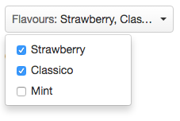

so-multiselect [](https://travis-ci.org/gordonmcg-sonalake/so-multiselect) [](https://codecov.io/github/gordonmcg-sonalake/so-multiselect) []()
================
> Angular module that provides a multi-select dropdown list with checkboxes.



Requirements
-----

The required dependencies are:

* [AngularJS](http://angular.org) (tested with version 1.2.28+)

This module was built with the intention of using it alongside [UI Bootstrap](https://github.com/angular-ui/bootstrap).

Demo
-----

For an example of `so-multiselect` in action, take a look at the demo app inside src/demo.

Alternatively, you can find the same [example on plunker.](https://plnkr.co/edit/E3E5KpHdwemNaoXtWimB?p=preview)

Getting Started
---------------

### Installation via Bower

The easiest way to install the module is to use bower:

```
bower install gordonmcg-sonalake/so-multiselect --save
bower update
```

### Basic Usage

Include the CSS and JS files in your `index.html` file:

```html
<script src="so-multiselect.js"></script>
<link rel="stylesheet" href="so-multiselect.css">
```

Declare dependencies on your module app like this:

```html
angular.module('myModule', ['so.multiselect']);
```

Set up your models in your controller:

```javascript

$scope.flavours = [{
	key: 'f1',
	name: 'Strawberry'
}, {
	key: 'f2',
	name: 'Classico'
}, {
	key: 'f3',
	name: 'Mint'
}];

$scope.chosenFlavours = [];

$scope.onFlavourSelected = function(selectedItems) {
	$scope.chosenFlavours = selectedItems;
};
```

Apply the directive to your HTML:

```html
<div so-multiselect items="flavourList" name="Flavours" on-selected="onFlavourSelected(selectedItems)" button-class="btn-grey"></div>
```

* `items` takes a reference to the array of object to appear in the dropdown list; each object must contain `key` and `name` attributes.
* `name` is the value for the label that appears inside the trigger for the dropdown list.
* `on-selected` takes a reference to the callback function you want to execute when an item is selected in the list. The `selectedItems` parameter contains an array of the selected objects.
* `button-class` is an optional attirbute if you wish to add any extra CSS classes to the trigger for the dropdown list.

Development
-----

### Building

We are using [npm](http://npmjs.com/), [bower](http://bower.io/) and [grunt](http://gruntjs.com/) as part of our development process.
To build the module from scratch, run the following commands:

```
npm install -g grunt-cli
npm install
bower install
grunt build
```

### Testing

We use [karma](http://karma-runner.github.io/0.12/index.html) and [protractor](http://angular.github.io/protractor/#/) to ensure the quality of the code.
To run the tests, run the following commands:

```
npm install -g grunt-cli
npm install
bower install
grunt test
```

### All Together

Running the tests and building the application can be done together using the following commands:

```
npm install -g grunt-cli
npm install
bower install
grunt
```

License
-----
[MIT License](http://en.wikipedia.org/wiki/MIT_License)
